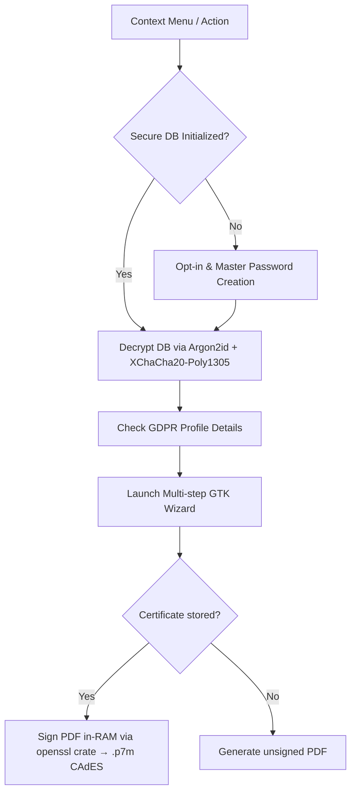

# Aggressive Unsubscribe Protocol 🍌

The **Aggressive Unsubscribe** protocol is a privacy-defense system integrated into the *Juanita Banana* browser. It provides a zero-friction, legally backed mechanism to force domains to purge the user's personal data under **GDPR Article 17 (Right to Erasure)**, and escalates to official supervisory authority complaints under **GDPR Article 77** if domains ignore the request. Reports can be **digitally signed** with a user-supplied eIDAS-qualified certificate (e.g. FNMT, idCAT, Izenpe) producing a legally valid CAdES `.p7m` envelope — entirely without writing the private key to disk.

---

## Code Layout & Organization

The implementation is highly modularized, split into dedicated packages for better maintainability and readability:

```
src/
├── ad_intoxication/              # Ad Intoxication Engine
│   ├── mod.rs                    # Re-exports engine module
│   └── engine.rs                 # Background click simulation logic
├── unsubscribe/                  # Core Business/Legal Logic
│   ├── mod.rs                    # Module declarations
│   ├── crawler.rs                # Background multi-threaded subpage scanner
│   ├── db/                       # Encrypted storage layer
│   │   ├── mod.rs                # SecureDbManager, all SQL helpers, public re-exports
│   │   ├── certs.rs              # PKCS#12 certificate persistence helpers
│   │   └── tests.rs              # Integration tests (kept separate for line-limit)
│   ├── email.rs                  # Notice formatting & SMTP delivery
│   ├── registry.rs               # Local JSON notified domain ledger
│   └── report.rs                 # GDPR Article 77 formal complaint compiler + CAdES signing
└── plugins/
    └── unsubscribe/              # UI Component & User Interactions
        ├── mod.rs                # Entrypoint hooking into context menu (re-exports only)
        ├── flow.rs               # Main setup flow & master password dialogs
        ├── wizard.rs             # Multi-step GTK Notebook layout
        ├── handlers.rs           # Navigation and general event binding
        ├── step_logic.rs         # Wizard step transition state machine (extracted for line-limit)
        ├── smtp_dialog.rs        # Unified SMTP/POP3/Certificate credentials dialog
        └── report_action.rs      # DPA complaint report generator handler
```

---

## Technical Architecture



### 1. Cryptographic Storage (`SecureDbManager`)
*   **Volatile Execution:** Sensitive profile, SMTP, POP3, and certificate data is decrypted from `~/.local/share/juanita-banana/userdata.enc` into `/dev/shm` (RAM disk) during execution, leaving no plaintext traces on the hard drive.
*   **Key Derivation:** Uses **Argon2id** with a high-memory profile to derive a 256-bit key from the user-provided master password.
*   **Authenticated Encryption:** Uses **XChaCha20-Poly1305** for AEAD encryption of the database file at rest.
*   **Automatic Shredding:** When the wizard is destroyed, the temporary in-memory database connection is closed, the DB is re-encrypted to disk, and the memory handle is safely cleared.
*   **Certificate Storage (`db_certs.rs`):** PKCS#12 blobs (`.p12` / `.pfx`) are stored inside the same encrypted vault. Only one certificate is kept at a time (replace semantics). Loaded at report generation time and parsed in RAM — the private key is never written to any filesystem path.

### 2. Status Registry (`unsubscribe_registry.json`)
Non-sensitive metadata (unsubscribed domains, dates, contact emails, and status of notices) is stored in a clean local JSON file (`unsubscribe_registry.json`) for quick lookup, preventing overhead in the main encrypted database.

---

## Wizard Step-by-Step Flow

The wizard is implemented using a GTK `Notebook` containing the following wizard pages:

| Page | Step Title | Description / Functionality |
| :--- | :--- | :--- |
| **0** | **Select Action** | Choose between **Unsubscribe New Domain** and **Report Reincident Domain**. |
| **1** | **Target Domain** | Choose between the **Current Domain** (extracted from the active tab), **Manual Domain Entry**, or **Search by Brand Name**. |
| **2** | **DDG Search** | If searching by brand, query DuckDuckGo, display the top 5 domains, and let the user select the target domain. |
| **3** | **Crawler & Verification** | Run the background crawler to scan the domain and its subpages (privacy, contact, terms, etc.) for emails. The user can select, deselect, or manually add contact addresses. |
| **4** | **GDPR Notice & Dispatch** | Preview the generated GDPR Article 17 erasure notice. Dispatch either via the encrypted SMTP outbox or via a `mailto:` link. Mark the domain status as `NOTIFIED`. |
| **5** | **Complaint Generation** | If a domain fails to comply, select it from the registry and generate a pre-populated GDPR Article 77 complaint report to download. Mark the domain status as `REINCIDENT`. |

---

## Background Email Crawler (`crawler.rs`)
*   **Thread Safety:** The crawler spawns a worker thread using `std::thread::spawn` and uses thread-safe GLib channels (`MainContext::channel`) to safely post results back to the GTK main loop without blocking UI rendering.
*   **Dual-Tier Crawling Strategy:**
    1.  *Quick Crawl:* A shallow search focusing on the homepage and high-probability internal links (e.g. keywords like `privacy`, `contact`, `legal`).
    2.  *Deep Crawl (Fallback):* If Quick Crawl yields no results, recursively traverses internal links up to a user-configurable maximum page limit (`deep_crawl_max_pages` in `juanita://config`, default: 25).
*   **Parsing Strategy:** Scans HTML text using regular expressions to harvest e-mails. It filters out common image, media, and archive extension noise (e.g., `.png`, `.jpg`, `.pdf`, `.zip`) to prevent false positives.
*   **Non-HTML Legal Document Scanning (Roadmap):** Future versions will include support for scanning non-HTML legal texts (such as linked PDFs, plain text `.txt` files, and Word documents). When detected, these files will be fetched, parsed with local text extraction libraries (such as `pdf-extract` or custom plaintext decoders), and searched for hidden contact emails or DPO addresses.

---

## Digital Signing (`report.rs` — `sign_pdf_cades_in_memory`)

When the user has stored an eIDAS-qualified PKCS#12 certificate in the secure vault, the GDPR Article 77 PDF complaint is wrapped in a **CAdES (CMS Advanced Electronic Signature)** envelope:

*   **Standard:** ETSI TS 101 903 / RFC 5652 CMS Signed-Data, DER-encoded `.p7m` file.
*   **Legal standing:** Equivalent to a handwritten signature in all EU member states under eIDAS Article 3(12). Accepted by all national DPAs for formal complaint submission.
*   **In-RAM only:** The `openssl` Rust crate parses the PKCS#12 and performs signing entirely in process heap memory. The private key is never written to disk, `/tmp`, or `/dev/shm` — SSD wear-leveling cannot retain it.
*   **Fallback:** If no certificate is configured or signing fails, a standard unsigned PDF is produced instead.

### Compatible certificates (non-exhaustive)

| Issuer | Country |
|---|---|
| FNMT-RCM (Fábrica Nacional de Moneda y Timbre) | 🇪🇸 Spain |
| ACCV, Izenpe, CATCert (idCAT), ANF AC, Camerfirma | 🇪🇸 Spain (regional) |
| Namirial, Infocert, Aruba PEC | 🇮🇹 Italy |
| Certinomis / Docapost | 🇫🇷 France |
| D-Trust (Bundesdruckerei) | 🇩🇪 Germany |
| QuoVadis / DigiCert EU, DocuSign EU | 🇪🇺 EU (cross-border) |

Any certificate appearing on the [EU Trusted List (EUTL)](https://esignature.ec.europa.eu/efts/browser) is accepted.

---

## Compliance & Legal Outputs
1.  **GDPR Article 17 Notice:** Formally instructs the data controller to erase all personal data, citing legal obligations, and requests confirmation within the 30-day statutory window.
2.  **GDPR Article 77 Complaint (unsigned PDF):** Formal complaint pre-populated with proof of notice, domain details, and user identifiers, ready for submission to the national DPA.
3.  **GDPR Article 77 Complaint (CAdES `.p7m`):** When a qualified certificate is stored, the complaint is wrapped in a digitally signed CAdES envelope, providing legally admissible proof of authenticity and non-repudiation when submitted to supervisory authorities.

### Accepting supervisory authorities (GDPR Art. 77)

A complaint may be filed with the DPA of any EU state where the data subject **resides**, **works**, or where the **infringement occurred**:

| Authority | Country |
|---|---|
| AEPD — Agencia Española de Protección de Datos | 🇪🇸 Spain |
| Garante per la protezione dei dati personali | 🇮🇹 Italy |
| CNIL — Commission Nationale de l'Informatique et des Libertés | 🇫🇷 France |
| BfDI — Bundesbeauftragter für den Datenschutz | 🇩🇪 Germany |
| ICO — Information Commissioner's Office | 🇬🇧 UK (UK-GDPR) |
| DPC — Data Protection Commission | 🇮🇪 Ireland |
| APD / GBA — Autorité de protection des données | 🇧🇪 Belgium |
| Datatilsynet | 🇩🇰 Denmark / 🇳🇴 Norway (EEA) |
| UODO | 🇵🇱 Poland |
| ANSPDCP | 🇷🇴 Romania |
| EDPB — European Data Protection Board | 🇪🇺 EU cross-border |
