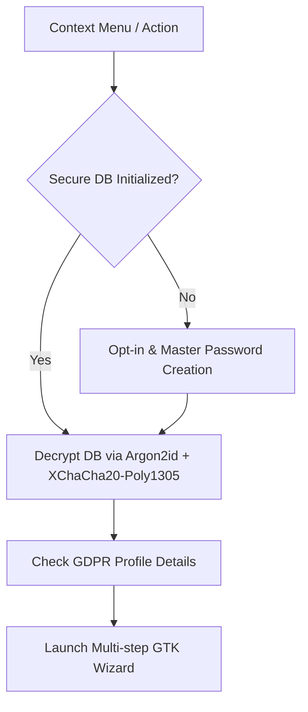

# Aggressive Unsubscribe Protocol 🍌

The **Aggressive Unsubscribe** protocol is a privacy-defense system integrated into the *Juanita Banana* browser. It provides a zero-friction, legally backed mechanism to force domains to purge the user's personal data under **GDPR Article 17 (Right to Erasure)**, and escalates to official supervisory authority complaints under **GDPR Article 77** if domains ignore the request.

---

## Code Layout & Organization

The implementation is highly modularized, split into dedicated packages for better maintainability and readability:

```
src/
├── ad_intoxication/              # Ad Intoxication Engine
│   ├── mod.rs                    # Re-exports engine module
│   └── engine.rs                 # Background click simulation logic
├── unsubscribe/                  # Core Business/Legal Logic
│   ├── mod.rs                    # Module declarations
│   ├── crawler.rs                # Background multi-threaded subpage scanner
│   ├── db.rs                     # Secure SQLite Cypher Profile, SMTP & POP3 storage
│   ├── email.rs                  # Notice formatting & SMTP delivery
│   ├── registry.rs               # Local JSON notified domain ledger
│   └── report.rs                 # GDPR Article 77 formal complaint compiler
└── plugins/
    └── unsubscribe/              # UI Component & User Interactions
        ├── mod.rs                # Entrypoint hooking into context menu (re-exports only)
        ├── flow.rs               # Main setup flow & master password dialogs
        ├── wizard.rs             # Multi-step GTK Notebook layout
        ├── handlers.rs           # Navigation and general event binding
        ├── smtp_dialog.rs        # Unified SMTP/POP3 credentials/opt-in configuration dialog
        └── report_action.rs      # DPA complaint report generator handler
```

---

## Technical Architecture



### 1. Cryptographic Storage (`SecureDbManager`)
*   **Volatile Execution:** Sensitive profile, SMTP, and POP3 data is decrypted from `~/.local/share/juanita-banana/userdata.enc` into `/dev/shm` (RAM disk) during execution, leaving no plaintext traces on the hard drive.
*   **Key Derivation:** Uses **Argon2id** with a high-memory profile to derive a 256-bit key from the user-provided master password.
*   **Authenticated Encryption:** Uses **XChaCha20-Poly1305** for AEAD encryption of the database file at rest.
*   **Automatic Shredding:** When the wizard is destroyed, the temporary in-memory database connection is closed, the DB is re-encrypted to disk, and the memory handle is safely cleared.

### 2. Status Registry (`unsubscribe_registry.json`)
Non-sensitive metadata (unsubscribed domains, dates, contact emails, and status of notices) is stored in a clean local JSON file (`unsubscribe_registry.json`) for quick lookup, preventing overhead in the main encrypted database.

---

## Wizard Step-by-Step Flow

The wizard is implemented using a GTK `Notebook` containing the following wizard pages:

| Page | Step Title | Description / Functionality |
| :--- | :--- | :--- |
| **0** | **Select Action** | Choose between **Unsubscribe New Domain** and **Report Reincident Domain**. |
| **1** | **Target Domain** | Choose between the **Current Domain** (extracted from the active tab), **Manual Domain Entry**, or **Search by Brand Name**. |
| **2** | **DDG Search** | If searching by brand, query DuckDuckGo, display the top 5 domains, and let the user select the target domain. |
| **3** | **Crawler & Verification** | Run the background crawler to scan the domain and its subpages (privacy, contact, terms, etc.) for emails. The user can select, deselect, or manually add contact addresses. |
| **4** | **GDPR Notice & Dispatch** | Preview the generated GDPR Article 17 erasure notice. Dispatch either via the encrypted SMTP outbox or via a `mailto:` link. Mark the domain status as `NOTIFIED`. |
| **5** | **Complaint Generation** | If a domain fails to comply, select it from the registry and generate a pre-populated GDPR Article 77 complaint report to download. Mark the domain status as `REINCIDENT`. |

---

## Background Email Crawler (`crawler.rs`)
*   **Thread Safety:** The crawler spawns a worker thread using `std::thread::spawn` and uses thread-safe GLib channels (`MainContext::channel`) to safely post results back to the GTK main loop without blocking UI rendering.
*   **Parsing Strategy:** Scans HTML text using regular expressions to harvest e-mails. It filters out common image extension noise (e.g., `.png`, `.svg`) to prevent false positives.
*   **Heuristic Subpage Crawling:** If emails are not found on the homepage, the crawler follows links containing keywords like `privacy`, `contact`, `legal`, or `terms` up to a depth of 6 pages.

---

## Compliance & Legal Outputs
1.  **GDPR Article 17 Notice:** Formally instructs the data controller to erase all personal data, citing legal obligations, and requests confirmation within the 30-day statutory window.
2.  **GDPR Article 77 Complaint:** Generates a formal text complaint pre-populated with proof of notice, domain details, and user identifiers, ready for submission to the National Data Protection Authority (DPA).
